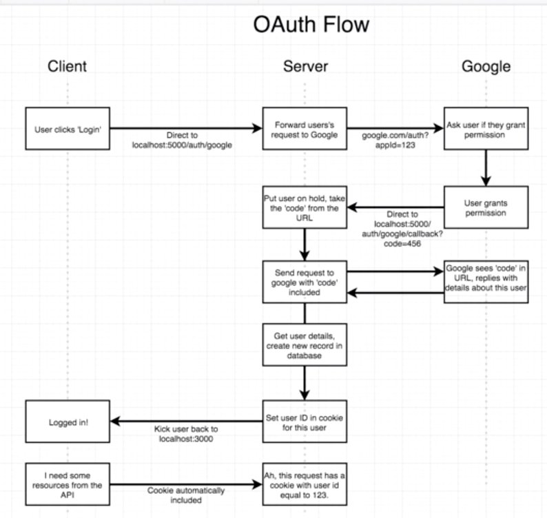

# :pencil: Note to Self

## Description

A simple web app for storing and retrieving small memories. Like a diary, but bite-sized. :apple:

### Technologies

1. [NodeJS](https://nodejs.org/en/) - Javascript backend server
2. [Express](https://expressjs.com/) - Routing, cookie management, HTTP helpers
3. [PassportJS](http://www.passportjs.org) - Handle OAuth 2.0 with Google
4. [Passport Google OAuth 2.0 Strategy](http://www.passportjs.org/packages/passport-google-oauth20/) - Specific Google provider plugin for Passport
5. [Google Developer API](https://console.developers.google.com/) - set up our OAuth
6. [MongoDB](https://www.mongodb.com/) - Persist user IDs to a Mongo store
7. [MLab](https://mlab.com/) - SaaS MongoDB hosting
8. [Heroku](https://www.heroku.com/) - PaaS server hosting - to run the Node/Express Server

## Local Setup

### Local Secrets

This boilerplate expects there to be secrets available at `config/dev.js`. More specifically, the keys it expects are:

- `googleClientID` - the Client ID provided by Google when you set up OAuth
- `googleClientSecret` - the Client Secret that comes with the above key
- `mongoURI` - the Mongo connection string, which contains an admin user in your MLab instance
- `cookieKey` - a key used to encrypt your cookie data
- `encKey` - used to encrypt memories
- `sigKey` - used to sign the encrypted memories

### Startup

From the `server/` directory, run:

```bash
$ yarn run dev
> *Startup noises*
```

This will startup both the backend and the webserver.

## How Auth Works

